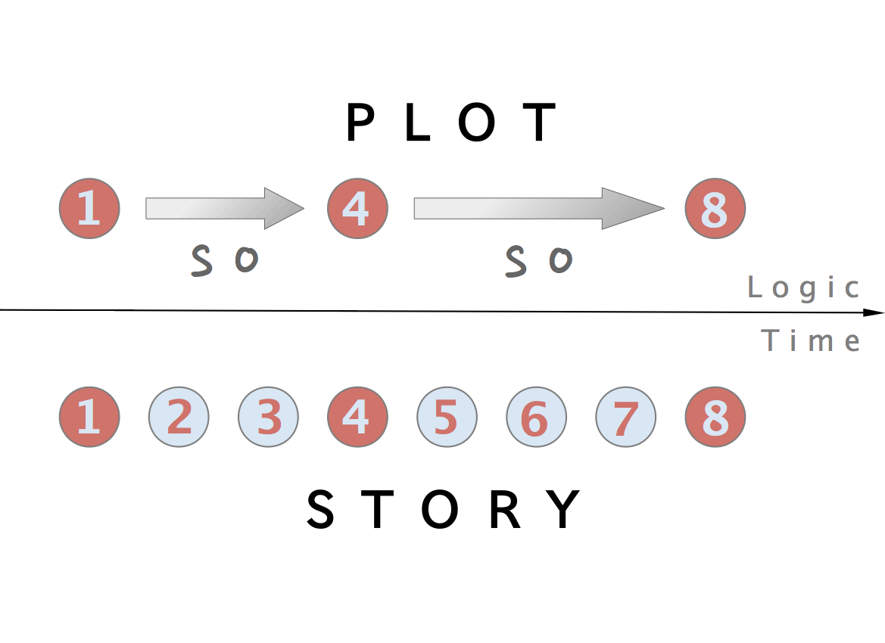
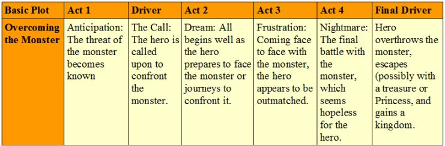
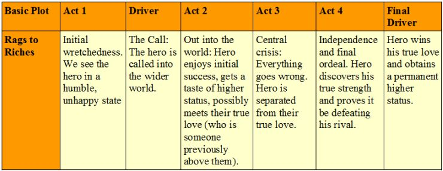
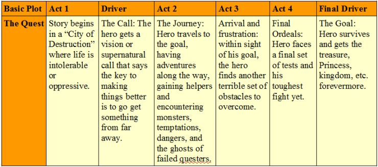
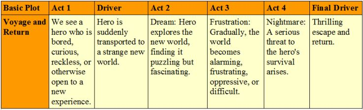
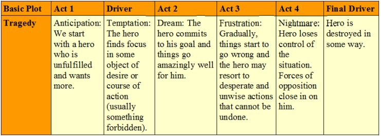
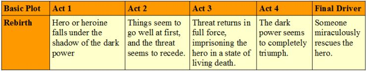

# rpg-aphorisms

# Index

- [Advice for dungeon masters](#for-dungeon-masters)
- [Advice for players](#for-players)
- [Definitions](#definitions)

# For Dungeon Masters

- [For any conclusion you want the PCs to make, include at least three clues](#aphorism-1)
- [Name your NPCs](#aphorism-2)
- [Throw obstacles at your PCs](#aphorism-3)
- [Appeal to all five of the senses](#aphorism-4)
- [Your stories should have a beginning, a middle and an end](#aphorism-7)
- [Avoid breaking suspension of disbelief](#aphorism-8)
- [Build a cast of ready made NPCs](#aphorism-9)
- [Reuse NPCs when possible](#aphorism-10)
- [Keep your players motivated](#aphorism-11)
- [Thou shalt not afflict players with thine own awe-inspiring characters](#aphorism-12)
- [Thou shalt not place thy plot above player wishes](#aphorism-13)
- [Thou shalt not display preferential treatment](#aphorism-14)
- [The seven basic plots ... plus two!](#aphorism-16)
- [Morphology of the Folktale](#aphorism-17)
- [The archetypal characters](#aphorism-18)
- [Story Structure 101: Super Basic Shit](#aphorism-19)

# For Players

- [Avoid creating intra-character conflict](#aphorism-5)
- [Avoid 'My guy' syndrome](#aphorism-6)
- [Be open to cooperation](#aphorism-15)

# Definitions

## Story

A narrative or story is a report of connected events, real or imaginary, presented in a sequence of written or spoken words, or still or moving images, or both. [wikipedia](https://en.wikipedia.org/wiki/Narrative)

## Plot

Plot refers to the sequence of events inside a story which affect other events through the principle of cause and effect. The causal events of a plot can be thought of as a series of sentences linked by "and so". Plots can vary from simple structures such as in a traditional ballad to complex interwoven structures sometimes referred to as an imbroglio. [wikipedia](https://en.wikipedia.org/wiki/Plot_(narrative))

## Suspension of disbelief

The term suspension of disbelief or willing suspension of disbelief has been defined as a willingness to suspend one's critical faculties and believe something surreal; sacrifice of realism and logic for the sake of enjoyment. [wikipedia](https://en.wikipedia.org/wiki/Suspension_of_disbelief)

# Aphorism 1

*For any conclusion you want the PCs to make, include at least three clues*

[the alexandrian](http://thealexandrian.net/wordpress/1118/roleplaying-games/three-clue-rule)

Whenever you’re designing a mystery scenario, you should invariably follow the Three Clue Rule:
For any conclusion you want the PCs to make, include at least three clues.
Why three? Because the PCs will probably miss the first; ignore the second; and misinterpret the third before making some incredible leap of logic that gets them where you wanted them to go all along.
I’m kidding, of course. But if you think of each clue as a plan (the PCs will find A, conclude B, and go to C), then when you have three clues you’ve not only got a plan — you’ve also got two backup plans. And when you realize that your plans never survive contact with the players, the need for those backup plans becomes clear.
In a best case scenario, of course, the players will find all three clues. There’s nothing wrong with that. They can use those clues to confirm their suspicions and reinforce their conclusions (just like Sherlock Holmes).
In a worst case scenario, they should be able to use at least one of these clues to reach the right conclusion and keep the adventure moving.
And here’s an important tip: There are no exceptions to the Three Clue Rule.
“But Justin!” I hear you say. “This clue is really obvious. There is no way the players won’t figure it out.”
In my experience, you’re probably wrong. For one thing, you’re the one designing the scenario. You already know what the solution to the mystery is. This makes it very difficult for you to objectively judge whether something is obvious or not.
And even if you’re right, so what? Having extra clues isn’t going to cause any problems. Why not be safe rather than sorry?

# Aphorism 2

*Name your NPCs*

[mattcolville](http://www.dndbeyond.com/forums/dungeons-dragons-discussion/dungeon-masters-only/846-tips-for-a-new-dm)

Make a list, right now, of male and female names, maybe 10 of each, that you think are appropriate to your setting. Clip it to your GM screen or whatever. Any time you need a name for an NPC, just grab the next one on the list. The goal here is to be able to make up an NPC and instantly know their name. The players will go places and meet people you haven't thought of and if you can say, at the drop of a hat, "The guard's name is Fandrick," it will seem to your players that these NPCs are real people who really exist and you're not just making it all up.

# Aphorism 3

*Throw obstacles at your PCs*

[Laura Backes](http://www.writing-world.com/children/obstacles.shtml) (this piece of advice is for childrens' fiction, but it applies to DMing)

But in order for a story to be really interesting, your character can't just think of a goal and then effortlessly reach it. As a writer, it's your job to throw obstacles in your character's way.
By developing obstacles that make sense, you add conflict and tension to the plot. If you progressively raise the stakes for your character throughout the story, you'll keep your readers turning pages to see what happens next.
The first obstacle your character will encounter is that of the critical situation. This is the point in the beginning of your story at which the character's life changes. Without this critical situation, the character's life would have gone on as before; but with it the character is forced to experience the story's events and challenges. This critical situation should relate directly to the character's goals, creating major shifts in the character's life.
Once you select the critical situation, get out your list of goals and select several that lend themselves to creating opportunities for relevant obstacles throughout the story. Some of these obstacles can be developed into sub-plots. For example:
- Does the character have to be somewhere at a specific time? Make him late, or make him miss the appointment altogether.
- Does the character need to find something? Make the search difficult or fruitless.
- Does the character need to communicate with someone? Have the note destroyed by weather, stolen by a bad guy or misinterpreted by the receiver.
- Does the character need to be alone? Make sure she's surrounded by people.

# Aphorism 4

*Appeal to all five of the senses*

[Goblins](http://goblinscomic.com/dungeon-master-tips)

Telling your players what their characters see around them is the bulk of what a DM does, but don’t forget to explain what their other senses are picking up as well. While you’re explaining the look of the buildings in the city that they just entered, maybe tell them how the city smells. If they’re in a vendor’s area, then you might explain the odour of spices and cooked meats floating through the air. If it’s a nasty side of town, then maybe the stink of urine is hanging about. If they’re creeping through a dank, dungeon hallway, then perhaps they can hear the echoed dripping of water coming from the shadows all around them. If a character wears gloves and the weather is warm, describe the sweaty feeling of the damp leather on his hands. Taped to the inside of my DM screen is a piece of paper that says “sight, smell, taste, touch, sound“. I keep it there to remind me to use whatever senses best fit the description. However, remember to keep you descriptions detailed, but short. Which reminds me…

# Aphorism 5

*Avoid creating intra-character conflict*

[Rich Burlew](http://www.giantitp.com/articles/tll307KmEm4H9k6efFP.html)

Here's another example: In a campaign I DM'd, the party's bard lifted a magical sword behind the back of the party's Lawful Good monk. The monk had basically decided that the bodies of several fallen knights would be buried without looting, and rather than argue, the bard just grabbed the sword. The bad news was, the sword was cursed; it was the blade that had belonged to a ghost that roamed the castle, and whenever the bard drew it, the ghost materialized and attacked him (and only him). Eventually, the bard 'fessed up that he had stolen the sword. The monk (and the monk's player) became furious, and declared that he could no longer travel with the bard. Either the bard had to leave, or he would. It became a huge argument between characters and players, and it was entirely unnecessary. The monk did not have to react with an ultimatum; the monk did not even have to be angry, no matter what his alignment was. The bard had already suffered the misfortune of having his Charisma drained by the ghost repeatedly; the monk could have chosen (for example) to lecture the bard on how his theft had brought him nothing but misery. He chose to create player conflict when it was just as easy to not.

# Aphorism 6

*Avoid 'my guy' syndrome*

[Alex P](https://rpg.stackexchange.com/a/37105/2968)

"My Guy" syndrome is when — often unwittingly — you disclaim decision-making power and responsibility by acting like "what my character would do" is inevitable and inviolable, even if it gets in the way of actually having fun in the game or being able to play the game at all.

# Aphorism 7

*Your stories should have a beginning, a middle and an end*

[Aristotle](https://en.wikipedia.org/wiki/Dramatic_structure) This was written about the ancient tragedy, however the dramatic structure it describes can be applied to any story. Of course this is not to say that you should not improvise, but keep in mind that your stories and sideplots should have a feeling of completeness.

Aristotle stated that the tragedy should imitate a whole action, which means that the events follow each other by probability or necessity, and that the causal chain has a beginning and an end. There is a knot, a central problem that the protagonist must face. The play has two parts: complication and unravelling. During complication, the protagonist finds trouble as the knot is revealed or tied; during unraveling, the knot is resolved.

# Aphorism 8

*Avoid breaking suspension of disbelief*

[tvtropes](http://tvtropes.org/pmwiki/pmwiki.php/Main/WillingSuspensionOfDisbelief). Immersion is when the players' suspension of disbelief is at its strongest.

An author's work, in other words, does not have to be realistic, only believable and internally consistent (even the last requirement can be relieved to some extent). When the author pushes an audience beyond what they're willing to accept, the work fails in the eyes of that particular audience. As far as science fiction is concerned, viewers are usually willing to go along with creative explanations which is why people don't criticize your wormhole travel system or how a shrinking potion doesn't violate the laws of matter conservation, but even in the more fantastical genres, suspension of disbelief can be broken when a work breaks its own established laws or asks the audience to put up with too many things that come off as contrived.

A common way of putting this is "You can ask an audience to believe the impossible, but not the improbable." For example, people will accept that the Grand Mage can teleport across the world, or that the spaceship has technology that makes it completely invisible without rendering its own sensors blind, but they won't accept that the ferocious carnivore just happened to have a heart attack and die right before it attacked the main character, or that the hacker guessed his enemy's password on the first try just by typing random letters, at least without some prior detail justifying it or one of the Rules listed below coming into play. What is in Real Life impossible just has to be made the norm in the setting and kept consistent.

# Aphorism 9

*Build a cast of ready made NPCs*

[Chris Fox](https://www.rpg.net/columns/evilgmfundamentals/evilgmfundamentals2.phtml)

This method is great, but what if your well of inspiration is feeling a little dry? In last month's article we covered an exercise to adapt scenes from your favorite movie or book into your campaign. You can do the same thing with characters, and if anything its even easier.

When watching a movie you really like take a good look at a character you want to include in your campaign. Ask yourself the questions above. Try looking for mannerisms, facial expressions or phrases the character uses. Jot those down in a notebook until you have a few paragraphs about the character. Then, sit down and modify him to fit your game. Do this every time you see someone cool in a movie.

Before you know it you'll have an assortment of NPCs who can fill all sorts of different roles in your game. If you need a random innkeeper, mayor or stable master take a look at your notes and see if you've built a profile to match. In most cases you will, and if you don't you can often adapt a profile by changing it to match what you need.

# Aphorism 10

*Reuse NPCs when possible*

[Katrina Ostrander](https://geekandsundry.com/how-to-integrate-character-backstories-into-rpg-campaigns/)

If your players sprinkled names or characters into their backstory, don’t let them fall to the wayside. Record their names and relationship, and refer back to them when it comes time to see who can help or hinder your group during a given task. As the players seek out shopkeepers, sources of information, or trainers over the course of the campaign, why create a new character when an existing NPC will do?

# Aphorism 11

*Keep your players motivated*

[Chris Perkins](http://dnd.wizards.com/articles/features/whats-my-motivation)

Breathing life into a D&D player character is the player's job, but keeping the character motivated and relevant is something the DM and player hash out together. It's a little bit like developing a television character. In television, you hire an actor to become a character, and once an actor is comfortable wearing that character's skin, the character takes on a life of its own. However, when the character is being underserved or its purpose called into question, the actor will often turn to the show's writers for ideas. Working together, the writers and actor can find new and clever ways to tie the character into whatever else is happening in the show.

# Aphorism 12

*Thou shalt not afflict players with thine own awe-inspiring characters*

[yandros](http://www.mit.edu/afs.new/sipb/user/yandros/rpg/gm-sins.txt)

Deadly Sin #1: Thou shalt not afflict players with thine own awe-inspiring characters. Don't send one of your own really kool characters with the PCs. Avoid the temptation!  Yes, yes, I know the PCs will sit in awe of the astounding skill levels and powers your totally kickbutt character has and that they will be thrilled by all the stories of the world shaking events the character has been involved with and they will be stunned by the astoundingly powerful array of magical artifacts the character has collected.  But give the PCs a chance to use their own pitiful skills, pathetic powers, and mundane equipment!

If lack of players or other reasons require extra party members, run them as background, an extra Intelligence check, or just another guy to go along.  Play them with character, but never allow them to make decisions that will affect the PC's.  This only happens when the PC's don't see a clue that is smack DAB in their faces. Also, NPCs are always last to get the new equipment.

Corollary to #1: Thou shalt not afflict players with awe inspiring omnipotent artifacts.  Never *ever* give the players that ever-so-cool magical item you created that has all those super powers and abilities and its intelligent and can kill deities in one stroke. Regardless of who you give it to, it is going to get hideously abused at some point. Give magic to match the characters.

# Aphorism 13

*Thou shalt not place thy plot above player wishes*

[yandros](http://www.mit.edu/afs.new/sipb/user/yandros/rpg/gm-sins.txt)

Deadly Sin #9: Thou shalt not place thy plot above player wishes. Never let your precious, inflexible storyline screw up good characters. Nobody likes to be railroaded.

Railroading has gotten a bad name.  There are many games out there that advertise themselves as "storytelling" that often demand that the characters don't screw things up.  Killing the main bad guy in the first session is bad.  GMs just need to fudge things a little to "naturally" keep the plot on track.

The idea isn't that they don't HAVE free will, they do. They are just made aware of the risks involved in attempting it (and failing) are grave. They are quite free to make those 4 drive rolls you mention, and perhaps die in a fiery automobile crash, but it's up to them. Of course everyone knows that in REALITY they aren't going to do it.

# Aphorism 14

*Thou shalt not display preferential treatment*

[yandros](http://www.mit.edu/afs.new/sipb/user/yandros/rpg/gm-sins.txt)

Deadly Sin #11: Thou shalt not display preferential treatment. Don't always pick out one member of the party and make the campaign center tightly around that person. Don't ignore efforts on the part of other players to carve out a niche for themselves in the campaign.

Whatever you do, don't ever display favoritism to anyone in your game!  I don't care if this is your girl/boyfriend, husband/wife, best friend from waaaay back JUST DON'T DO IT!  Nothing ticks off players more than a perceived bias on the GM's part for (or even against, if unjustified!) another player.  If you can't be impartial, for political reasons or otherwise, in your treatment of a specific player, don't invite that player to games involving other players. If you can't leave out the player (by virtue, say, of being married to him or her), don't run games. You'll lose your players in the end anyway, so what's the point?

Special corollary:  The above takes on critical importance if you find the player in question attractive.

Corollary to the corollary:  Exercise extreme caution if the player's significant other is also in the party.....

# Aphorism 15

*Be open to cooperation*

[Alex](https://www.cherrypickedgames.com/role-playing/2015/9/25/problematic-players)

We’ve all played in a campaign with this character. They are the natural loner with distrust of authority, teams, and other people in general. At best, they are contrary to the game master’s characters and slow down story progression. At worst, they split off from the party to have their own exciting adventures, leaving the rest of the crew out of focus and bored. Unfortunately, this loner persona is an easy one to develop for players of all skill levels. The genre often promotes ideas of tragic backstories or segregation from normal society. These characters are interesting, but playing them is more challenging than it appears.

The problem is a lack of cooperation. Help this player build bonds with others. There’s a natural story arc of the loner character learning to care about and love their party. They become the family that never accepted them or they never had. It may seem clichéd, but it’s a sturdy plot development to continue character growth. This acceptance plays out differently each time. Whether the loner is saved by a fellow adventurer or the whole party is pitted against the world and not cooperating is suicide, the group can come to a nice harmony.

One of our regular Catalyst players, Jared, averts the Lone Wolf behavior well. The character of his that comes to mind is Dan, a gruff ex-soldier brimming with hate and frustration. Dan was stuck with two high school misfits (we made our characters independently…) and forced into the role of a competent leader. Rather than dismissing the obnoxious children around him, Jared decided to endow his character with parental instinct. No one else could whip Aiden and Bryawn into shape, so Dan reluctantly took them under his wing. Despite the repeated insults and death threats, he cared about them.

# Aphorism 16

*The seven basic plots ... plus two!*

[Christopher Booker](https://en.wikipedia.org/wiki/The_Seven_Basic_Plots)

**Overcoming the Monster**
The protagonist sets out to defeat an antagonistic force (often evil) which threatens the protagonist and/or protagonist's homeland.
Examples: Perseus, Theseus, Beowulf, Dracula, The War of the Worlds, Nicholas Nickleby, The Guns of Navarone, Seven Samurai and its Western-style remake The Magnificent Seven, the James Bond franchise, and Star Wars: A New Hope.[2]

**Rags to Riches**
The poor protagonist acquires things such as power, wealth, and a mate, before losing it all and gaining it back upon growing as a person.
Examples: Cinderella, Aladdin, Jane Eyre, A Little Princess, Great Expectations, David Copperfield, The Prince and the Pauper, Brewster's Millions.[2]

**The Quest**
The protagonist and some companions set out to acquire an important object or to get to a location, facing many obstacles and temptations along the way.
Examples: Odyssey, The Pilgrim’s Progress, King Solomon's Mines, Watership Down,[2] The Lord of the Rings, Harry Potter and the Deathly Hallows, The Land Before Time, One Piece, the Indiana Jones franchise, The Voyage of the Dawn Treader, Harold & Kumar Go To White Castle

**Voyage and Return**
The protagonist goes to a strange land and, after overcoming the threats it poses to him or her, returns with experience.
Examples: Odyssey, Ramayana, Alice in Wonderland, Goldilocks and the Three Bears, Orpheus, The Time Machine, Peter Rabbit, The Hobbit, Mad Max: Fury Road, Brideshead Revisited, The Rime of the Ancient Mariner, Gone with the Wind, The Third Man,[2] Chronicles of Narnia, Apollo 13, Labyrinth, Finding Nemo, Gulliver's Travels, Spirited Away, Uncharted, The Wizard of Oz. Back To The Future.

**Comedy**
Light and humorous character with a happy or cheerful ending; a dramatic work in which the central motif is the triumph over adverse circumstance, resulting in a successful or happy conclusion.[3] Booker makes sure to stress that comedy is more than humor. It refers to a pattern where the conflict becomes more and more confusing, but is at last made plain in a single clarifying event. Most romances fall into this category.
Examples: A Midsummer Night's Dream, Much Ado About Nothing, Twelfth Night, Bridget Jones's Diary, Music and Lyrics, Sliding Doors, Four Weddings and a Funeral, Mr. Bean

**Tragedy**
The protagonist is a hero with one major character flaw or great mistake which is ultimately their undoing. Their unfortunate end evokes pity at their folly and the fall of a fundamentally 'good' character.
Examples: Macbeth, The Picture of Dorian Gray, Carmen, Bonnie and Clyde, Jules et Jim, Anna Karenina, Madame Bovary, John Dillinger, Romeo and Juliet, Julius Caesar,[2] Death Note, Breaking Bad, Dirty Mary, Crazy Larry, Hamlet, Beowulf, The Room

**Rebirth**
During the course of the story, an important event forces the main character to change their ways, often making them a better person.
Examples: The Frog Prince, Beauty and the Beast, The Snow Queen, A Christmas Carol, The Secret Garden, Peer Gynt,[2] Life Is a Dream, Despicable Me, Machine Gun Preacher, Megamind, How the Grinch Stole Christmas

**Basic Plots Booker Dislikes...**
The last two basic plots are ones which Booker clearly sees as inferior, because they are less about the main character embracing his feminine side.

**Mystery**
First, he defines Mystery as a story in which an outsider to some horrendous event or drama (such as a murder) tries to discover the truth of what happened. Often what is being investigated in a Mystery is a story based on one of the other plots. Booker dislikes Mysteries because the detective or investigator has no personal connection to the characters he's interviewing or the crime he's investigating. Therefore, Booker argues, the detective has no inner conflict to resolve. This may be true many of Mysteries, including some by Sir Arthur Conan Doyle or Agatha Christie. However, in other Mystery stories the detective does have a personal stake in the plot, which gives rise to inner conflict – often a moral dilemma. Chinatown, is one example that springs to mind. So is Murder on the Orient Express and The Maltese Falcon (just to name some classics). Nonetheless, it is true that Mysteries often do not leave one with the sense that the world has been totally healed (after all, innocent victims are still dead). This sets it apart from most of the basic stories - with the exception perhaps of Tragedy.

**Rebellion Against 'The One'**
The last of Booker's basic plots, Rebellion Against 'The One' concerns a hero who rebels against the all-powerful entity that controls the world until he is forced to surrender to that power. The hero is a solitary figure who initially feels the One is at fault and that he must preserve his independence or refusal to submit. Eventually, he is faced with the One's awesome power and submits, becoming part of the rest of the world again. In some versions, the One is portrayed as benevolent, as in the story of Job, while in others the reader is left convinced it is malevolent, as in 1984 or Brazil. These darker versions seem to be what make Booker less than keen on this basic plot. Though Booker doesn't mention it, a common variation is to have the hero refuse to submit and essentially win against the power of the One. In The Prisoner, the hero eventually earns the right to discover that the One is a twisted version of himself, after which he is set free. In The Matrix, Neo's resistance eventually leads to a better world. Another example is The Hunger Games series, where Katniss's continued rebellion eventually leads to the downfall of both the original tyrant and his potential successor, resulting in a freer world.

# Aphorism 17

*Morphology of the Folktale*

[Vladimir Propp](https://en.wikipedia.org/wiki/Vladimir_Propp)

After the initial situation is depicted, the tale takes the following sequence of 31 functions:[4]
1. ABSENTATION: A member of the hero's community or family leaves the security of the home environment. This may be the hero themselves, or some other relation that the hero must later rescue. This division of the cohesive family injects initial tension into the storyline. This may serve as the hero's introduction, typically portraying them as an ordinary person.
2. INTERDICTION: A forbidding edict or command is passed upon the hero ('don't go there', 'don't do this'). The hero is warned against some action.
3. VIOLATION of INTERDICTION. The prior rule is violated. Therefore the hero did not listen to the command or forbidding edict. Whether committed by the Hero by accident or temper, a third party or a foe, this generally leads to negative consequences. The villain enters the story via this event, although not necessarily confronting the hero. They may be a lurking and manipulative presence, or might act against the hero's family in his absence.
4. RECONNAISSANCE: The villain makes an effort to attain knowledge needed to fulfill their plot. Disguises are often invoked as the villain actively probes for information, perhaps for a valuable item or to abduct someone. They may speak with a family member who innocently divulges a crucial insight. The villain may also seek out the hero in their reconnaissance, perhaps to gauge their strengths in response to learning of their special nature.
5. DELIVERY: The villain succeeds at recon and gains a lead on their intended victim. A map is often involved in some level of the event.
6. TRICKERY: The villain attempts to deceive the victim to acquire something valuable. They press further, aiming to con the protagonists and earn their trust. Sometimes the villain make little or no deception and instead ransoms one valuable thing for another.
7. COMPLICITY: The victim is fooled or forced to concede and unwittingly or unwillingly helps the villain, who is now free to access somewhere previously off-limits, like the privacy of the hero's home or a treasure vault, acting without restraint in their ploy.
8. VILLAINY or LACKING: The villain harms a family member, including but not limited to abduction, theft, spoiling crops, plundering, banishment or expulsion of one or more protagonists, murder, threatening a forced marriage, inflicting nightly torments and so on. Simultaneously or alternatively, a protagonist finds they desire or require something lacking from the home environment (potion, artifact, etc.). The villain may still be indirectly involved, perhaps fooling the family member into believing they need such an item.
9. MEDIATION: One or more of the negative factors covered above comes to the attention of the Hero, who uncovers the deceit/perceives the lacking/learns of the villainous acts that have transpired.
10. BEGINNING COUNTERACTION: The hero considers ways to resolve the issues, by seeking a needed magical item, rescuing those who are captured or otherwise thwarting the villain. This is a defining moment for the hero, one that shapes their further actions and marks the point when they begin to fit their noble mantle.
11. DEPARTURE: The hero leaves the home environment, this time with a sense of purpose. Here begins their adventure.
12. FIRST FUNCTION OF THE DONOR: The hero encounters a magical agent or helper (donor) on their path, and is tested in some manner through interrogation, combat, puzzles or more.
13. HERO'S REACTION: The hero responds to the actions of their future donor; perhaps withstanding the rigours of a test and/or failing in some manner, freeing a captive, reconciles disputing parties or otherwise performing good services. This may also be the first time the hero comes to understand the villain's skills and powers, and uses them for good.
14. RECEIPT OF A MAGICAL AGENT: The hero acquires use of a magical agent as a consequence of their good actions. This may be a directly acquired item, something located after navigating a tough environment, a good purchased or bartered with a hard-earned resource or fashioned from parts and ingredients prepared by the hero, spontaneously summoned from another world, a magical food that is consumed, or even the earned loyalty and aid of another.
15. GUIDANCE: The hero is transferred, delivered or somehow led to a vital location, perhaps related to one of the above functions such as the home of the donor or the location of the magical agent or its parts, or to the villain.
16. STRUGGLE: The hero and villain meet and engage in conflict directly, either in battle or some nature of contest.
17. BRANDING: The hero is marked in some manner, perhaps receiving a distinctive scar or granted a cosmetic item like a ring or scarf.
18. VICTORY: The villain is defeated by the hero – killed in combat, outperformed in a contest, struck when vulnerable, banished, and so on.
19. LIQUIDATION: The earlier misfortunes or issues of the story are resolved; object of search are distributed, spells broken, captives freed.
20. RETURN: The hero travels back to their home.
21. PURSUIT: The hero is pursued by some threatening adversary, who perhaps seek to capture or eat them.
22. RESCUE: The hero is saved from a chase. Something may act as an obstacle to delay the pursuer, or the hero may find or be shown a way to hide, up to and including transformation unrecognisably. The hero's life may be saved by another.
23. UNRECOGNIZED ARRIVAL: The hero arrives, whether in a location along their journey or in their destination, and is unrecognised or unacknowledged.
24. UNFOUNDED CLAIMS: A false hero presents unfounded claims or performs some other form of deceit. This may be the villain, one of the villain's underlings or an unrelated party. It may even be some form of future donor for the hero, once they've faced their actions.
25. DIFFICULT TASK: A trial is proposed to the hero – riddles, test of strength or endurance, acrobatics and other ordeals.
26. SOLUTION: The hero accomplishes a difficult task.
27. RECOGNITION: The hero is given due recognition – usually by means of their prior branding.
28. EXPOSURE: The false hero and/or villain is exposed to all and sundry.
29. TRANSFIGURATION: The hero gains a new appearance. This may reflect aging and/or the benefits of labour and health, or it may constitute a magical remembering after a limb or digit was lost (as a part of the branding or from failing a trial). Regardless, it serves to improve their looks.
30. PUNISHMENT: The villain suffers the consequences of their actions, perhaps at the hands of the hero, the avenged victims, or as a direct result of their own ploy.
31. WEDDING: The hero marries and is rewarded or promoted by the family or community, typically ascending to a throne.

# Aphorism 18

*The archetypal characters*

[Vladimir Propp](https://en.wikipedia.org/wiki/Vladimir_Propp)

It's also noted on the [mini-guide to structuralism](http://people.ds.cam.ac.uk/blf10/Links/structuralism.html) elsewhere on this server that Vladimir Propp's Morphology of the Folktale (1928) identified seven archetypal characters, which he called **actants**. These are:
- the villain
- the provider
- the helper
- the princess and her father
- the dispatcher
- the hero
- the false hero

# Aphorism 19

*Story structure 101: super basic shit*

[Dan Harmon](https://channel101.fandom.com/wiki/Story_Structure_101:_Super_Basic_Shit)

Storytelling comes naturally to humans, but since we live in an unnatural world, we sometimes need a little help doing what we'd naturally do.

Draw a circle and divide it in half vertically.

Divide the circle again horizontally.

Starting from the 12 o clock position and going clockwise, number the 4 points where the lines cross the circle: 1, 3, 5 and 7.

Number the quarter-sections themselves 2, 4, 6 and 8.

Here we go, down and dirty:

- A character is in a zone of comfort,
- But they want something.
- They enter an unfamiliar situation,
- Adapt to it,
- Get what they wanted,
- Pay a heavy price for it,
- Then return to their familiar situation,
- Having changed.

Start thinking of as many of your favorite movies as you can, and see if they apply to this pattern. Now think of your favorite party anecdotes, your most vivid dreams, fairy tales, and listen to a popular song (the music, not necessarily the lyrics). Get used to the idea that stories follow that pattern of descent and return, diving and emerging. Demystify it. See it everywhere. Realize that it's hardwired into your nervous system, and trust that in a vacuum, raised by wolves, your stories would follow this pattern. 
